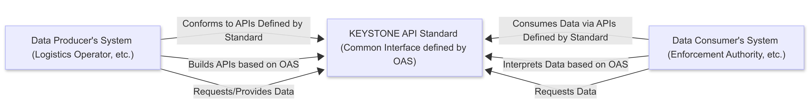

# KEYSTONE API Standard

<p align="center">
  
</p>

The **KEYSTONE API Standard** is a robust and modular framework designed to standardize logistics operations APIs. It provides a unified structure for managing transport operations, driver, and vehicle data exchanges, enabling organizations to integrate these functionalities into their systems with minimal effort. By leveraging this framework, users can focus on building their own server to expose the APIs they need, while relying on the standardized data models and access scripts provided. The KEYSTONE API Standard is designed to be extensible, allowing users to adapt it to their specific requirements while maintaining compatibility with the broader logistics ecosystem.

This framework is developed as part of the [KEYSTONE project](https://www.keystone-project.com/) ([CORDIS: 101103740](https://cordis.europa.eu/project/id/101103740)), an initiative funded by the European Union’s Horizon Europe programme under the auspices of **DG CINEA** (European Climate, Infrastructure and Environment Executive Agency), which aims to create a standardized API ecosystem for logistics operations across Europe.

## Relationship between the KEYSTONE API Standard and Integrating Systems
The relationship between the KEYSTONE API Standard and the integrating systems can be conceptually illustrated as follows:

<p align="center">
  
</p>

Conceptually, the KEYSTONE API Standard works as a guidance framework: every Data Producer designs their API according to the shared rules, and every Data Consumer queries APIs that adhere to this guidance. This align-to-the-standard approach replaces tangled point-to-point integrations with a scalable, maintainable architecture. Supplementary tools, like client libraries and modular access scripts, further streamline development, making implementation faster and less error-prone.

## Key Features

- **Standardized API Design**: Provides a consistent structure for logistics APIs.
- **Extensibility**: Users can fork or clone the repository and build their own server for exposing APIs.
- **Modular Design**: Separate subsets for transport operations, driver, and vehicle data.
- **Ease of Use**: Minimal effort required to adapt the framework to specific needs.

## Releases

The KEYSTONE API Standard follows semantic versioning to manage and track changes. Each version is tagged in the repository, allowing users to download specific releases.

### v0.1.0

The initial release of the KEYSTONE API Standard includes:
- Standardized API definitions for transport operations, driver, and vehicle data.
- Modular access scripts for customizing data management logic.
- OpenAPI Specification for easy integration and testing.
- Sample server implementations.

## Getting Started

### 1. Clone the Repository

To get started, clone the repository to your local environment:

```bash
git clone https://github.com/AethonGr/keystone-api-standard
cd keystone-api-standard
```

### 2. Install the Framework and Dependencies

Ensure you have Python 3.10+ installed. You can install the framework and its dependencies in one of two ways:

#### Option 1: Install as a standard Python package (Recommended)

If you want to use the framework as a Python package, install it using:

```bash
pip install .
```

This links the installation to your cloned repository, so any changes you make to the source code (e.g., in the `api/` directory) will be immediately effective.

#### Option 2: Use the repository "as is"

If you want to work directly with the cloned repository, install the dependencies using:

```bash
pip install -r requirements.txt
```

This approach is suitable for users who want to explore or modify the framework without installing it as a Python package.

### 3. Build Your Server

The essential package for building your server is the `api/` directory. This directory contains all the core components required to implement and expose APIs for transport operations, driver, and vehicle data. 

**Note**: The `test_server` folder contains sample implementations that demonstrate how to use the `api/` package to expose APIs. These samples serve as a reference and can be adapted to suit your specific needs.

### 4. Customize Access Scripts

Modify the `_access.py` scripts located in the `entities` folder within the `api` directory to implement your custom logic for querying and managing data. For example:
- `driver_access.py` for driver-related operations.
- `vehicle_access.py` for vehicle-related operations.
- `transport_operation_access.py` for transport operation-related operations.

### 5. Deploy

Deploy your server to your preferred environment (e.g., Docker, cloud platforms) to expose the APIs.

## Folder Structure

- `api/`: Contains APIs and access scripts for transport operations, driver and vehicle data, as well as data models and endpoints for handling these functionalities.
- `assets/`: Contains static resources such as images.
- `openapi/`: Contains the OpenAPI Specification for the project.
- `test_server/`: Provides sample server implementations for testing and validating API functionality.

## OpenAPI Specification

The KEYSTONE API Standard includes an [OpenAPI Specification](openapi/openapi.yaml) that defines the structure and endpoints of the APIs. Additionally, the OpenAPI Specification is hosted online and can be accessed [here](https://keystone-api-standard.eu.apidog.com).

This hosted version provides an interactive interface to explore the API endpoints, their parameters and responses. It allows developers to test the APIs directly, making it easier to understand and integrate the APIs into their systems.

## Community Contributions

The KEYSTONE API Standard is open source and fosters collaboration. Contributions are welcome and encouraged to improve the KEYSTONE API Standard.

### How to Contribute

1. Fork the repository and create a new branch for your feature or bug fix.
2. Follow the coding standards and guidelines outlined in the [CONTRIBUTING](CONTRIBUTING.md) file.
3. Submit a pull request with a clear description of your changes.

We value contributions that enhance functionality, improve documentation or address issues.

By contributing, you help build a standardized and extensible API framework for the logistics ecosystem.

## License

The KEYSTONE API Standard is licensed under the [GNU General Public License v3.0 (GPLv3)](https://www.gnu.org/licenses/gpl-3.0.html). For full terms, see the [LICENSE](LICENSE) document.

## Support

If you have any questions, suggestions, or need assistance, please open an issue on the repository or contact the project team at info@aethon.gr.
