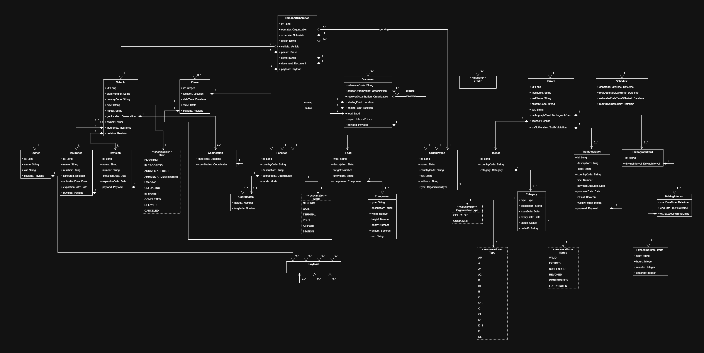

The `data_model` folder contains the data models used throughout the KEYSTONE API Standard. These models define the structure and validation rules for entities such as transport operations, drivers, vehicles, and related entities.

## Contents

- **Data Model**: Python classes that represent the entities used in the APIs.
- **Validation Rules**: Constraints and rules to ensure data integrity.

## Files 

- **`base.py`**: Defines the `HandleBaseModel`, a shared Pydantic `BaseModel` that provides common configuration for all data models, including custom serialization logic.
- **`data_model.py`**: Contains the core data models for the application, such as `TransportOperation`, `Driver`, and `Vehicle`.
- **`ecmr.py`**: Contains the data models related to the e-CMR, provided by [Open Logistics Foundation](https://openlogisticsfoundation.org/ecmr/) (v0.1).

## Guidance for Users

1. **Understanding the Model**: The data model in this folder are designed to provide a strict and standardized structure for all entities used in the API. Users should familiarize themselves with these models to understand how data is represented and validated.
2. **Integration**: They serve as the foundation for ensuring that all data conforms to the expected structure and rules.

## Data Model Diagram

Below is a UML diagram illustrating the relationships and structure of the data model:

## Notes

This folder provides a standardized and immutable approach to defining and managing data entities, ensuring consistency and reliability across the API.
